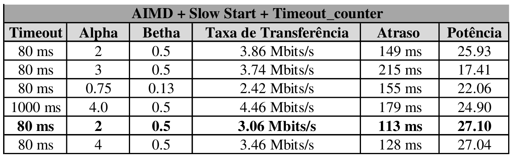
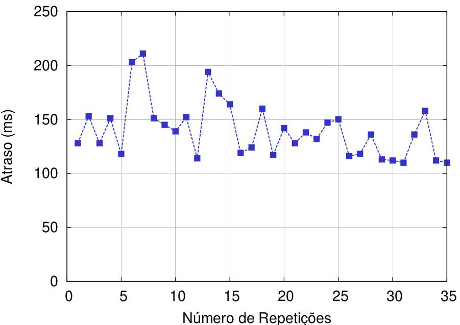
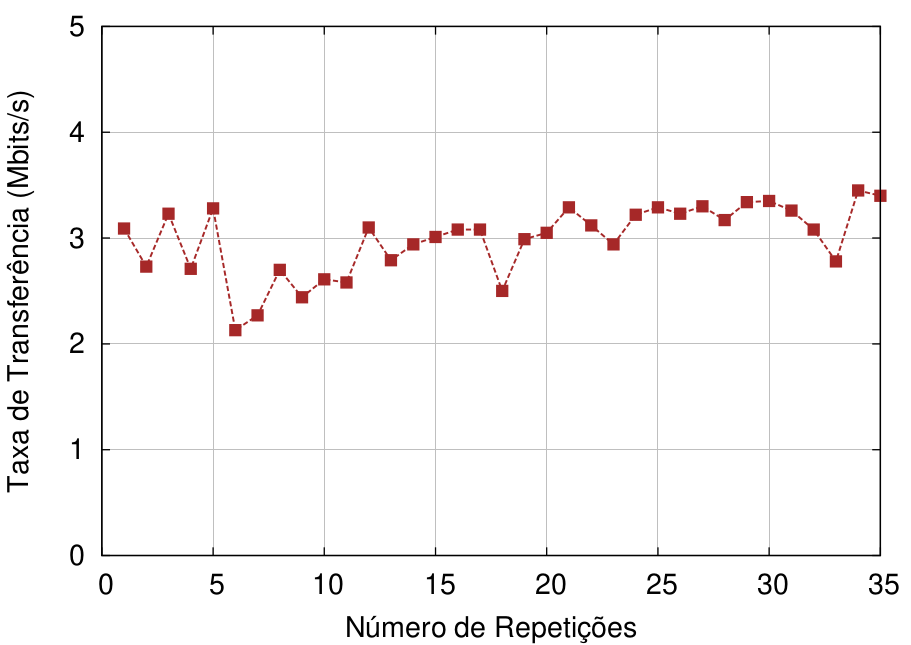
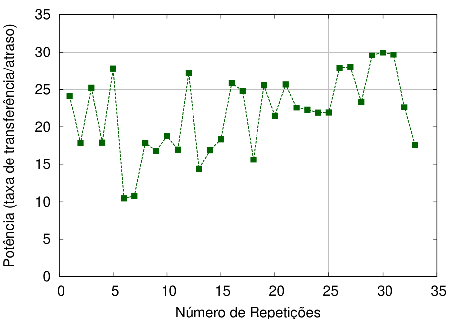
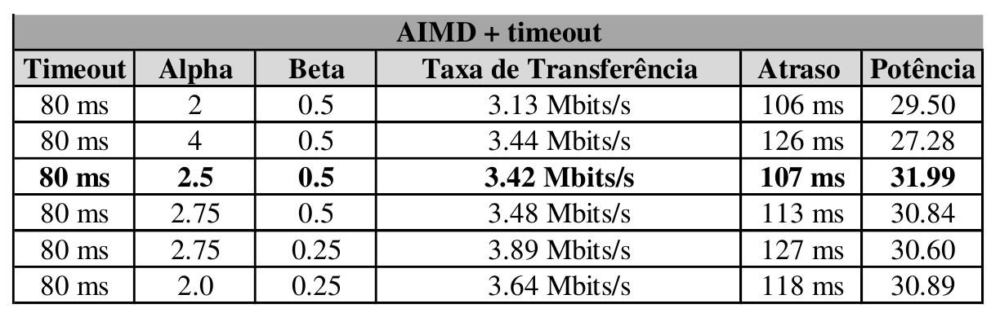

# Controle de Congestionamento
# Trabalho Prático 2 (TP2) - INFO7015 NR2-CCSC/UFPR 

teste
## Contextualização

Este TP2 aborda conceitos e problemas relacionados ao controle de congestionamento. O protocolo TCP da camada de transporte possui um mecanismo de controle de congestionamento fim a fim, denominado **AIMD** (aumento aditivo, diminuição multiplicativa) [2]. Em resumo, este mecanismo obriga cada remetente a limitar a sua taxa de envio de tráfego quando percebe congestionamento na rede. Ou seja, se o remetente perceber que há pouco congestionamento no caminho até o destinatário, ele irá aumentar a sua taxa de envio; e se perceber que existe congestionamento, irá reduzir a taxa de envio. Esta taxa de envio é limitada através da janela de congestionamento (CWND). Dessa forma, a quantidade de dados não reconhecidos, não pode exceder o valor mínimo da janela. Outra questão importante é como um remetente detecta um congestionamento na rede. No protocolo TCP, um remetente percebe um evento de perda quando ocorre o esgotamento do temporizador (timeout) ou quando recebe três ACKS duplicados do destinatário. O intervalo de expiração do temporizador é o TimeoutInterval, calculado a partir da estimação do tempo de ida e volta (RTT) de um segmento. Mais detalhes sobre a detecção de congestionamento pode ser visto no Capítulo 3 do livro "Redes de Computadores e a Internet" [2].

Na literatura, existem diferentes algoritmos de controle de congestionamento que, no geral, podem ser classificados como baseado em perda e baseado em atraso. Os métodos baseados em perda (ex.: Cubic, NewReno e Compound) reduzem sua janela apenas quando há perda de pacotes ou quando recebem notificações explícitas de congestionamento. Por outro lado, os algoritmos baseado em atraso (ex.: Vegas, FAST, LEDBAT, Sprout e Copa) reduzem suas taxas de transferência conforme aumenta o atraso. No entanto, um recente trabalho [1] apresenta alguns obstáculos que ainda precisam ser resolvidos na integração de ambos os tipos (baseado em perda e atraso). Dentre os obstáculos, um dos problemas consiste na taxa de transferência dos algoritmos baseado em atraso que é muito ruim quando competem no mesmo gargalo com remetentes que empregam algoritmos baseado em perda. Isso acontece porque os remetentes baseado em perda aumentam suas taxas de transferência até detectar algum congestionamento, o que aumenta o atraso na fila. Devido a esse aumento do atraso, um fluxo que utiliza um algoritmo baseado em atraso irá reduzir sua taxa de transferência a fim de reduzir o atraso. Isso resultará em largura de banda disponível. Por isso, o fluxo com base em perda irá utilizar essa largura de banda. Dessa forma, a taxa de transferência do baseado em atraso irá piorar, e ainda assim não reduzirá o atraso. Além disso, a maioria do tráfego da Internet utiliza algoritmos com base em perda, dificultando a justificativa para utilizar os com base em atraso.

Com base nessas observações, apesar do controle de congestionamento ser um tópico abordado desde a criação do protocolo TCP, podemos notar que ainda existem questionamentos e trabalhos em aberto. Além disso, trata-se de um tema de grande importância na área de redes de computadores. Devido a isso, o TP2 da disciplina INFO7015 - NR2-CCSC/UFPR aborda questões relacionadas ao controle de congestionamento como taxa de transferência, atrasos, perda de pacotes e etc. Dessa forma, o texto a seguir apresenta as simulações realizadas, os resultados alcançados e as dificuldades encontradas durante o desenvolvimento do TP2.

 Esse texto está disponível também em minha [wiki avergutz_ccsc](https://andressavergutz.wordpress.com/info7015-tp2/). 


## Exercícios

O TP2 possui quatro atividades principais. Por isso, os experimentos e resultados são apresentados de acordo com essas atividades.

### Exercício de aquecimento A: 

A fim de avaliar a potência (taxa de transferência versus atraso) observamos o comportamento do cenário de simulação com diferentes valores no tamanho da janela de congestionamento. Iniciamos com o tamanho da janela igual a 5, e aumentamos de 5 em 5 até chegar ao tamanho 40. Repetimos 35 vezes cada cenário com janela de tamanho diferente. A Fig. 1 apresenta o atraso médio *vs* o tamanho da janela e a Fig. 2 ilustra a taxa de transferência média *vs* o tamanho da janela. Note que tanto o menor atraso médio, quanto a menor taxa de transferência média foram obtidos com tamanho de janela igual a 10. Conforme cresce o tamanho da janela de congestionamento ambas as métricas apresentam valores maiores. Ou seja, quando obtemos uma maior taxa de transferência, significa que estamos ocupando uma maior capacidade da largura de banda e alcançando maior vazão. Por consequência, aumenta também o atraso na fila e entrega dos segmentos. Além do mais, pode levar a perda de segmentos. Apenas para curiosidade e confirmar nossas conclusões, testamos a janela de congestionamento com tamanho 100. Neste cenário o atraso médio alcançou mais de 1.000 ms de atraso médio. 


A Fig. 3 apresenta os resultados relacionados a potência *vs* tamanho da janela de congestionamento. A métrica potência foi obtida através da seguinte equação:

Potência = ((taxa de transferência  ⁄ atraso) × 1000)

Com base nos resultados apresentados na Fig. 3, podemos observar que a potênica apresenta um crescimento e logo em seguida volta a cair. O melhor resultado alcançado para a métrica da potência (taxa de transferência / atraso) foi com o tamanho da janela 20. Com tamanho de janela 25, a potência cai levemente. Com os valores 5 e 10 para o tamanho da janela, encontramos os menores resultados para potênica (menores que 4). Note que quanto maior for o valor alcançado para a potência, melhor será o desempenho entre taxa de transferência e atraso. Isso ocorre, pois os cenários em que a potência apresentou valores maiores se referem a momentos em que o atraso diminuiu, e por consequência, a taxa de transferência aumentou.


### Exercício de aquecimento B: Implemtação do esquema AIMD simples

Nesta atividade, implementamos o esquema AIMD que é utilizado na fase de prevenção de congestionamento do TCP. Como explicado anteriormente, o AIMD limita a taxa de envio do remetente quando perceber congestionamento na rede. Esta taxa de envio é limitada através da janela de congestionamento (CWND). Essa janela indica a quantidade de bytes que o remetente pode transmitir na rede. Dessa forma, o TCP aumenta linearmente o tamanho da sua janela até que ocorra um evento de perda. Esse evento pode ser detectado através do esgotamento do timeout ou ACK duplicado triplo. Quando houver um evento de perda, o algoritmo AIMD reduz exponencialmente o tamanho da janela, mas começa de novo aumentá-la linearmente em busca de largura de banda adicional disponível. O TCP possui também a fase de partida lenta, cujo qual é o ponto inicial do seu algoritmo. Nessa fase a janela de congestionamento incrementa de forma exponencial conforme ACKs são recebidos. Caso a janela alcançar um valor maior ou igual ao seu limiar (ssthresh), o algoritmo passa para a fase de prevenção de congestionamento (AIMD). 

Para desenvolver o AIMD adicionamos três variáveis: alpha, beta e ssthresh. Visto que alpha se refere ao aumento aditivo da janela, beta a diminuição multiplicativa de CWND e ssthresh consiste do limiar da partida lenta. Todas as alterações e implementações foram realizadas no arquivo controller.cc. Alteramos os valores das três variáveis a fim de testar diferentes resultados. A Tabela 1 apresenta os resultados alcançados com o AIMD simples. Dentre os resultados, a melhor potência alcançada foi 7.76, com valores 0.13 para beta, 0.75 para alpha e 60 para ssthresh. Com base nesses resultados, percebemos que a potência diminuiu com o uso do AIMD em relação aos resultados anteriores. Isso acontece, pois o AIMD é justo na utilização do canal. Além disso, salientamos que utilizamos o valor 13 para o tamanho inicial da janela de congestionamento (cwnd = 13), pois tamanhos maiores resultaram em atrasos maiores.


### Exercício C: Testes diferentes abordagens e trabalhe para maximizar a potência

A fim de melhorar a potência (taxa de transferência vs atraso) alteramos o valor de timeout, diminuindo de 1000 ms para 80 ms. Além disso, adicionamos um contador do timeout (inicializado com valor 0 e o seu limiar com valor 4), pois podem haver casos em que, apesar de esgotar o temporizador, o atraso não se refira a congestionamentos ou perdas. O esgotamento do temporizador é controlado por meio do RTT (tempo de ida e volta do pacote). Dessa forma, RTTs maiores que timeout indicam perda. A Tabela 2 apresenta os resultados alcançados. Nesse cenário conseguimos aumentar a potência para 27.10, com valores 0.5 para beta e 2 para alpha. A melhoria dos resultados se deve pelo fato de controlarmos o esgotamento do temporizador, não permitindo que a janela de congestionamento cresca de forma exponencial quando o RTT ultrapassar timeout.













### Exercı́cio D: escolha um nome legal para o seu esquema!

SherlockPower (SPow) 


## Para reproduzir nossas análises:

Para executar os testes deste respositório você precisará instalar o Mininet em sua máquina ou criar uma máquina virtual (VM). Nós utilizamos o Mininet v2.2.2. Além disso, como a Tabela 1 do artigo apresenta resultados tanto do protocolo TCP quanto do MPTCP, foram criadas duas máquinas virtuais no VirtualBox v5.1.38:

```
1 - 
    
``` 


### Instalando nosso repositório


<<<<<<< HEAD


Divirta-se! (:


=======

Divirta-se! (:
>>>>>>> f30361e17736d5b95fa1ec641234ac9a7fb3febf
