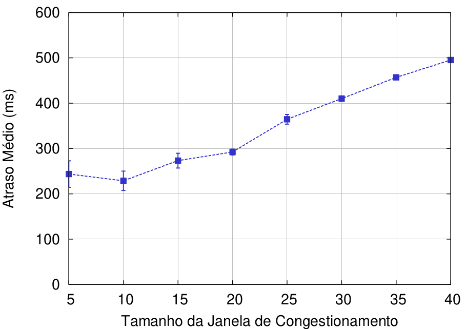
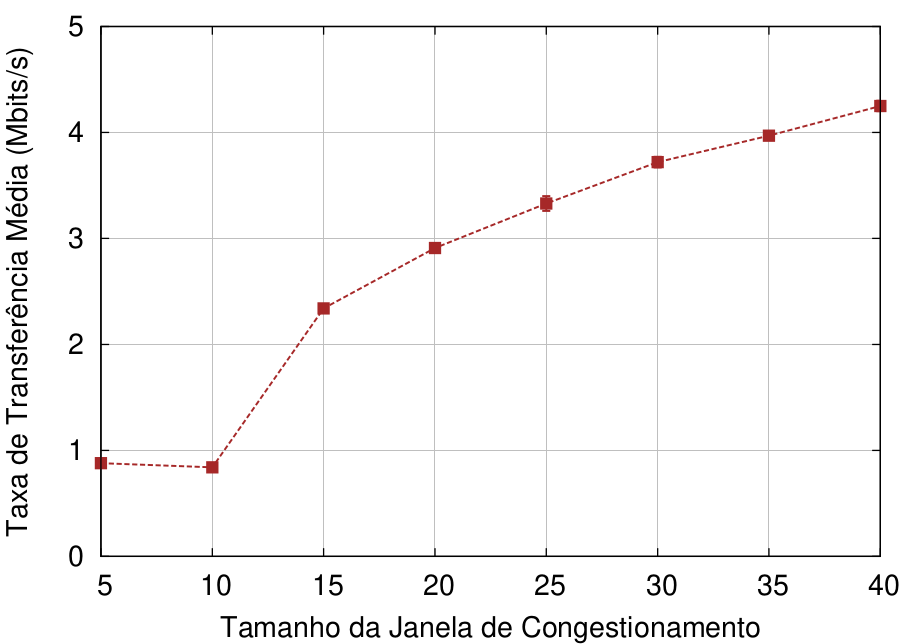
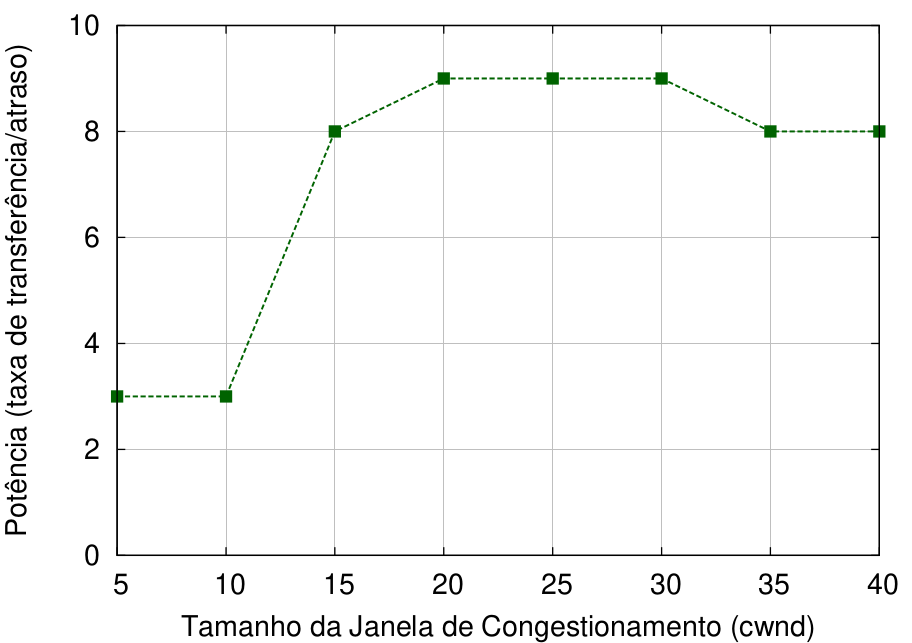
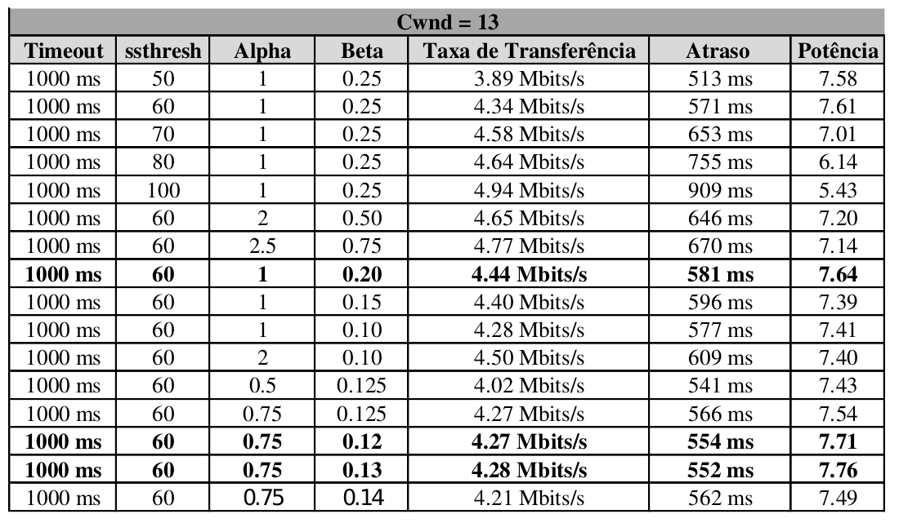

<<<<<<< HEAD
# Controle de Congestionamento
# Trabalho Prático 2 (TP2) - INFO7015 NR2-CCSC/UFPR 


## Contextualização

Este TP2 aborda conceitos e problemas relacionados ao controle de congestionamento. O protocolo TCP da camada de transporte possui um mecanismo de controle de congestionamento fim a fim, denominado **AIMD** (aumento aditivo, diminuição multiplicativa) [2]. Em resumo, este mecanismo obriga cada remetente a limitar a sua taxa de envio de tráfego quando percebe congestionamento na rede. Ou seja, se o remetente perceber que há pouco congestionamento no caminho até o destinatário, ele irá aumentar a sua taxa de envio; e se perceber que existe congestionamento, irá reduzir a taxa de envio. Esta taxa de envio é limitada através da janela de congestionamento (cwnd). Dessa forma, a quantidade de dados não reconhecidos, não pode exceder o valor mínimo da janela. Outra questão importante é como um remetente detecta um congestionamento na rede. No protocolo TCP, um remetente percebe um evento de perda quando ocorre o esgotamento do temporizador (timeout) ou quando recebe três ACKS duplicados do destinatário. O intervalo de expiração do temporizador é o TimeoutInterval, calculado a partir da estimação do tempo de ida e volta (RTT) de um segmento. Mais detalhes sobre a detecção de congestionamento pode ser visto no Capítulo 3 do livro "Redes de Computadores e a Internet" [2].

Na literatura, existem diferentes algoritmos de controle de congestionamento que podem ser classificados como baseado em perda e baseado em atraso. Os métodos baseados em perda (ex.: Cubic, NewReno e Compound) reduzem sua janela apenas quando há perda de pacotes ou quando recebem notificações explícitas de congestionamento. Por outro lado, os algoritmos baseados em atraso (ex.: Vegas, FAST, LEDBAT, Sprout e Copa) reduzem suas taxas de transferência conforme aumenta o atraso, a fim de controlar a perda de pacotes e bufferbloat. No entanto, um recente trabalho [1] apresenta um obstáculo em desenvolver algoritmos com base em atraso na Internet: a taxa de transferência dos algoritmos baseado em atraso é muito ruim quando competem no mesmo gargalo com remetentes que empregam algoritmos baseado em perda. Isso acontece porque os remetentes baseado em perda aumentam suas taxas de transferência até detectar alguma perda, o que aumenta o atraso na fila. Devido a esse aumento do atraso, um fluxo que utiliza um algoritmo baseado em atraso irá reduzir sua taxa de transferência a fim de reduzir o atraso. Isso resultará em largura de banda disponível. Por isso, o fluxo com base em perda irá utilizar essa largura de banda. Dessa forma, a taxa de transferência do baseado em atraso irá piorar, e ainda assim não reduzirá o atraso. Além disso, a maioria do tráfego da Internet utiliza algoritmos com base em perda, dificultando a justificativa para utilizar os com base em atraso.


Com base nessas observações, apesar do controle de congestionamento ser um tópico abordado desde a criação do protocolo TCP, podemos notar que ainda existem questionamentos e trabalhos em aberto. Além disso, trata-se de um tema de grande importância na área de redes de computadores. Devido a isso, o TP2 da disciplina INFO7015 - NR2-CCSC/UFPR aborda questões relacionadas a taxa de transferência, atrasos, perda de pacotes e etc. Dessa forma, o texto a seguir apresenta os experimentos realizados, os resultados alcançados e as dificuldades encontradas.

 Esse texto está disponível também em minha [wiki avergutz_ccsc](https://andressavergutz.wordpress.com/info7015-tp2/). 


## Exercícios

O TP2 possui quatro atividades principais. Por isso, os experimentos e resultados são apresentados de acordo com essas atividades.

### Exercício de aquecimento A: 

A fim de avaliar a potência (taxa de transferência versus atraso) observamos o comportamento do cenário de simulação com diferentes valores no tamanho da janela de congestionamento. Iniciamos com o tamanho da janela igual a 5, e aumentamos de 5 em 5 até chegar ao tamanho 40. Repetimos 35 vezes cada cenário com janela de tamanho diferente. A Fig. 1 apresenta o atraso médio vs o tamanho da janela e a Fig. 2 ilustra a taxa de transferência vs o tamanho da janela. Note que tanto o menor atraso médio, quanto a menor taxa de transferência média foram obtidos com tamanho de janela igual a 10. Conforme cresce o tamanho da janela de congestionamento ambas as métricas apresentam valores maiores. Ou seja, quando obtemos uma maior taxa de transferência, significa que estamos ocupando uma maior capacidade da largura de banda e alcançando maior vazão. Por consequência, aumenta também o atraso na fila e entrega dos segmentos. Além do mais, pode levar a perda de segmentos (observe que não calculamos a perda de segmentos). Devido a essas questões, um tamanho de janela menor apresenta um melhor tradeoff entre taxa de transferência e atraso. Apenas para curiosidade e confirmar nossas conclusões, testamos a janela de congestionamento com tamanho 100. Neste cenário o atraso médio alcançou mais de 1.000 ms de atraso médio. 




A Fig. 3 apresenta os resultados relacionados a potência vs tamanho da janela de congestionamento. A métrica potência foi obtida através da seguinte equação:

Potência = ((taxa de transferência  ⁄ atraso) × 1000)

Com base nos resultados apresentados na Fig. 3, podemos observar que a potênica apresenta um crescimento e logo em seguida volta a cair. O melhor resultado alcançado para a métrica da potência (taxa de transferência / atraso) foi com o tamanho da janela 20. Com tamanho de janela 25, a potência cai levemente. Com os valores 5 e 10 para o tamanho da janela, encontramos os menores resultados para potênica (menores que 4). Note que quanto maior for o valor alcançado para a potência, melhor será o desempenho entre taxa de transferência e atraso. Isso ocorre, pois os cenários em que a potência apresentou valores maiores se referem a momentos em que o atraso diminuiu, e por consequência, a taxa de transferência aumentou.



### Exercício de aquecimento B: Implemtação do esquema AIMD simples

Nesta atividade, implementamos o esquema AIMD (Additive Increase Multiplicative Decrease), que é utilizado na fase de prevenção de congestionamento do TCP. Como explicado anteriormente, o AIMD limita a taxa de envio do remetente quando perceber congestionamento na rede. Esta taxa de envio é limitada através da janela de congestionamento (cwnd). Essa janela indica a quantidade de bytes que o remetente pode transmitir na rede. Dessa forma, o AIMD se embasa no congestionamento da rede para determinar o tamanho da janela. Ou seja, o TCP aumenta linearmente o tamanho da sua janela até que ocorra um evento de perda. Esse evento pode ser detectado através do esgotamento do timeout ou ACK duplicado triplo. Quando houver um evento de perda, o algoritmo AIMD reduz exponencialmente o tamanho da janela, mas começa de novo aumentá-la linearmente em busca de largura de banda adicional disponível. O TCP possui também a fase de partida lenta, cujo qual é o ponto inicial do seu algoritmo. Nessa fase a janela de congestionamento incia com valor 1 e incrementa de forma exponencial conforme ACKs são recebidos. Caso a janela alcançar um valor maior ou igual ao seu limiar (slow treshold), o algoritmo passa para a fase de prevenção de congestionamento (AIMD). Nesta fase, a janela é divida por metade do seu valor quando detectado a perda, e o crescimento da janela é linear.




### Exercício D: Testes diferentes abordagens e trabalhe para maximizar a potência

### Exercı́cio E: escolha um nome legal para o seu esquema!

SherlockPower (SPow) 


## Para reproduzir nossas análises:

Para executar os testes deste respositório você precisará instalar o Mininet em sua máquina ou criar uma máquina virtual (VM). Nós utilizamos o Mininet v2.2.2. Além disso, como a Tabela 1 do artigo apresenta resultados tanto do protocolo TCP quanto do MPTCP, foram criadas duas máquinas virtuais no VirtualBox v5.1.38:

```
1 - 
    
``` 


### Instalando nosso repositório


Obs.: A única restrição é que os resultados são apenas para a topologia Jellyfish. O Fat-tree não conseguimos implementar.


Divirta-se! (:


=======
# TP2-Redes
TP2 sobre controle de congestionamento em redes
>>>>>>> 33d48da72092684ca5d5d8e19a48816c5c238f21
